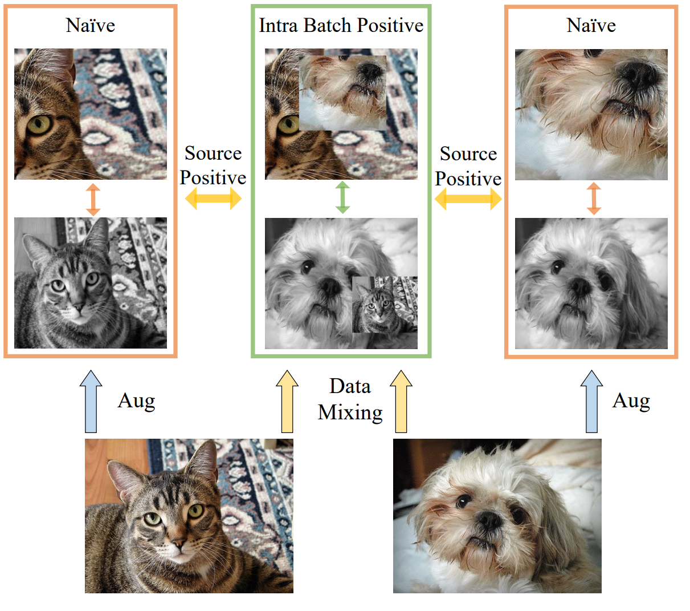

# SDMP
This is the offical implementation of 	
["A Simple Data Mixing Prior for Improving Self-Supervised Learning"](https://cihangxie.github.io/data/SDMP.pdf)
by [Sucheng Ren](https://oliverrensu.github.io/), [Huiyu Wang](https://csrhddlam.github.io/), [Zhengqi Gao](https://zhengqigao.github.io/), [Shengfeng He](http://www.shengfenghe.com/), [Alan Yuille](http://www.cs.jhu.edu/~ayuille/), [Yuyin Zhou](https://yuyinzhou.github.io/), [Cihang Xie](https://cihangxie.github.io/)



## MoCo with SDMP
Installing packages as [Moco v3](https://arxiv.org/abs/2104.02057).

Training ViT small on 4 nodes.
```
cd moco
# ImageNet
# On the first node
python main_moco.py \
  -a vit_small \
  --optimizer=adamw --lr=1.5e-4 --weight-decay=.1 \
  --epochs=300 --warmup-epochs=40 \
  --stop-grad-conv1 --moco-m-cos --moco-t=.2 \
  --dist-url 'tcp://hostnode:port' \
  --multiprocessing-distributed --world-size 4 --rank 0 \
  /path/to/imagenet
# On the rest node --rank 1, 2, 3

# ImageNet100
python main_moco.py \
  -a vit_small -b 512 \
  --optimizer=adamw --lr=1.5e-4 --weight-decay=.1 \
  --epochs=300 --warmup-epochs=40 \
  --stop-grad-conv1 --moco-m-cos --moco-t=.2 \
  --dist-url 'tcp://localhost:port' \
  --multiprocessing-distributed --world-size 1 --rank 0 \
  /path/to/imagenet100
```

## Plug-in example


The extra version:
```
x1, x2, x3, x4 = data #from four different views  
# Naive loss
q1 = encoder(x1)
q1 = encoder(x2)
k1 = momentum_encoder(x1) #no_grad
k2 = momentum_encoder(x2) #no_grad
naive_loss = contrastive_loss(q1, k2)+contrastive_loss(q2, k1) # two views

# data mixing  mix x3 and x4 with the same lambda
lam, x3_mix, x4_mix = mix(x3, x3.flip(0), x4, x4.flip(0))
q3_mix = encoder(x3_mix)
k4 = momentum_encoder(x4) #no_grad
k4_mix = momentum_encoder(x4_mix) #no_grad

# Mix loss (Mix and Source)
ms_loss = contrastive_loss(q3, k4)*lam + contrastive_loss(q3, k4.flip(0)) *(1-lam)

# Mix loss (Intra-batch Mix)
 common = np.minimum(lam, 1-lam.clone().flip()) + np.minimum(1-lam, lam.clone().flip())
mb_loss = contrastive_loss(q3, k4_mix)*(1/(1+common)) + contrastive_loss(q3, k4_mix.flip(0)) *(common/(1+common))

m_loss = # one extra view
Loss = naive_loss + ms_loss + mb_loss
```


If you have any question, feel free to email [Sucheng Ren](oliverrensu@gmail.com)

## Citing SDMP
If you think think this paper and responsity is useful, please cite 
```
@inproceedings{ren2022sdmp,
  title     = {A Simple Data Mixing Prior for Improving Self-Supervised Learning},
  author    = {Ren, Sucheng and Wang, Huiyu and Gao, Zhengqi and He, Shengfeng and Yuille, Alan and Zhou, Yuyin and Xie, Cihang},
  booktitle = {CVPR},
  year      = {2022}
}
}
```
